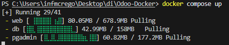
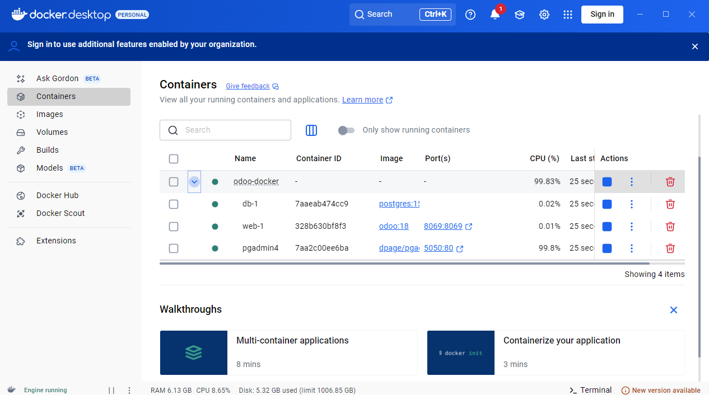
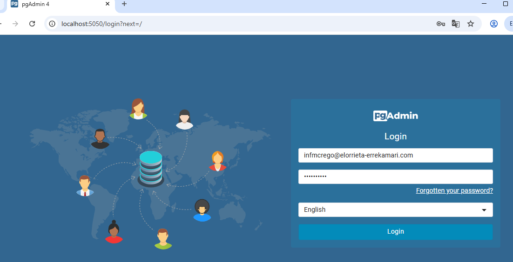
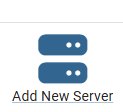
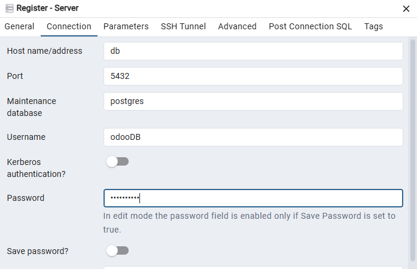
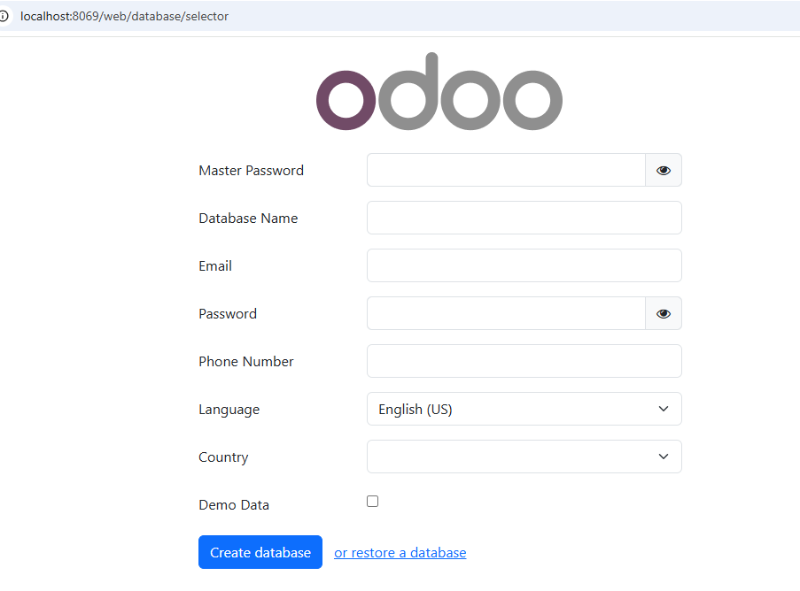
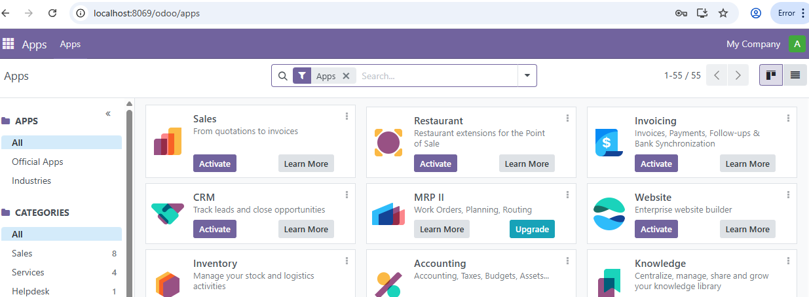
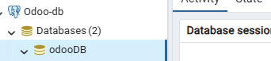

# Odoo con Docker

## Docker

Docker es una plataforma de software que permite crear, ejecutar y gestionar contenedores. Es ampliamente usada en desarrollo de software, DevOps y despliegue de aplicaciones.

### ¿Qué es Docker?
Docker es una **tecnología de contenedores**. Un **contenedor** es una especie de "caja" que incluye una aplicación y todo lo que necesita para ejecutarse (código, librerías, dependencias, sistema operativo, etc.). Esto garantiza que la aplicación funcione de la **misma forma en cualquier sistema**.

### ¿Para qué sirve?
Algunos de los usos principales son los siguientes.


| Uso | Explicación |
| ------------ | ------------- |
| Empaquetar aplicaciones |	Puedes agrupar tu app con sus dependencias en una imagen Docker. |
| Portabilidad | Puedes mover tu contenedor entre distintos sistemas operativos y servidores sin preocuparte por compatibilidad. |
| Aislamiento | Cada contenedor es independiente. Esto evita conflictos entre versiones de dependencias, librerías, etc. |
| Desarrollo ágil | Los desarrolladores pueden trabajar en ambientes idénticos al de producción.|
| Despliegue automatizado | Muy usado con CI/CD para desplegar apps de manera rápida y confiable. |
| Escalabilidad |	Se integra bien con herramientas como Kubernetes para escalar aplicaciones fácilmente. |

### ¿Para qué sirve?

| Característica | Docker (Contenedor) | Máquina Virtual |
| ------------ | ------------- | ------------- |
| Ligero        | Si            | No (más pesado) |
| Arranque rápido | Segundos | Minutos |
| Requiere sistema operativo completo| No |  Si |


### Docker Desktop

La aplicación que vamos a utilizar para montar y ejecutar los contenedores es `Docker Desktop`. Se puede [descargar](https://www.docker.com/products/docker-desktop/) desde la página oficial.


## Docker Compose
**Docker Compose** es una herramienta que te permite **definir y ejecutar <ins>múltiples</ins> contenedores Docker a la vez**, usando un solo archivo de configuración llamado `docker-compose.yml` o `compose.yaml`...

> Es ideal cuando la aplicación necesita varios servicios funcionando juntos (por ejemplo: un backend, una base de datos, un servidor web, etc.).

### ¿Para qué sirve Docker Compose?

| Función	|  Descripción |
| ------------ | ------------- |
| 
| Orquestar varios contenedores | 	Puedes levantar varios servicios con un solo comando. | 
|  Configuración centralizada | Todo se define en un solo archivo YAML (docker-compose.yml). | 
|  Reproducibilidad | 	Te aseguras de que todos los entornos tengan la misma configuración. | 
|  Simplicidad | 	En lugar de correr múltiples comandos docker run, usas uno solo. | 

### ¿Cómo funciona?

En el archivo previamente mencionado se define:
* Los servicios (contenedores) que necesita tu app
* Las imágenes Docker a usar
* Los puertos, volúmenes, y variables de entorno
* Las dependencias entre servicios (por ejemplo: que el backend espere a que la base de datos esté lista)


### Comandos de Docker Compose
Se puede encontrar el listado [aquí](https://docs.docker.com/reference/cli/docker/compose/), pero vamos a resumir a los más relevantes.

#### Montar y arrancar los contenedores
```docker-compose up```

#### Arrancar los contenedores
```docker-compose start```

#### Parar los contenedores
```docker-compose stop```

#### Parar y eliminar los contenedores
```docker-compose down```

#### Parar y eliminar los contenedores con todos los datos almacenados
En ocasiones, como cuando se crean mal los contenedores, querremos eliminar también los volúmenes con los datos almacenados.
```docker-compose down --volumes```

### Ventajas de Docker Compose
* Simplicidad al trabajar con múltiples servicios
* Reproduce entornos iguales en desarrollo, testing y producción
* Evita errores humanos por comandos manuales
* Ideal para proyectos en equipo


## Odoo

**Odoo** es un **software de gestión empresarial (ERP)** de código abierto, modular y muy flexible.

ERP significa *Enterprise Resource Planning* (Planificación de Recursos Empresariales), y es un sistema que ayuda a las empresas a gestionar diferentes áreas en una sola plataforma integrada.

### ¿Para qué se utiliza Odoo?

Odoo se usa para **automatizar y gestionar** diversas funciones dentro de una empresa, como:
* **Ventas:** seguimiento de clientes, cotizaciones, facturación.
* **Inventario y almacén:** controlar stock, entradas y salidas.
* **Compras:** gestionar proveedores, órdenes de compra.
* **Contabilidad:** finanzas, facturas, reportes contables.
* **Recursos humanos:** gestión de empleados, nóminas, vacaciones.
* **Proyectos:** seguimiento de tareas y tiempos.
* **Marketing:** campañas, CRM, email marketing.
* **Manufactura:** control de producción y operaciones.
* **E-commerce:** creación de tiendas online integradas.

### ¿Por qué es popular
* Modular: puedes instalar solo los módulos que necesitas.
* Flexible: adaptable a empresas de distintos tamaños y sectores.
* Código abierto: puedes personalizarlo y extenderlo.
* Integrado: todas las funciones están conectadas, evitando duplicidad de datos.
* Comunidad grande: mucha documentación, apps y soporte.

### Comparativa Odoo vs Dolibarr
| Característica          | Odoo                                          | Dolibarr                                    |
|------------------------|--------------------------------------------------|------------------------------------------------|
| **Tipo**               | ERP modular y plataforma todo en uno              | ERP y CRM ligero y sencillo                      |
| **Código**             | Código abierto, pero también versión paga (Enterprise) con funciones extra | 100% código abierto y gratuito                    |
| **Facilidad de uso**   | Interfaz moderna y atractiva, pero puede ser compleja para principiantes | Más simple, ideal para pymes pequeñas             |
| **Módulos**            | Más de 30 módulos oficiales y miles de apps en la comunidad | Módulos básicos para ERP, CRM, facturación, proyectos, etc. |
| **Flexibilidad**       | Altamente personalizable, se adapta a empresas medianas y grandes | Menos flexible, más enfocado en pequeñas empresas |
| **Implementación**     | Puede ser más compleja y costosa                  | Más fácil y rápida de implementar                 |
| **Comunidad y soporte**| Comunidad grande, pero soporte oficial suele ser pago | Comunidad activa y soporte mayormente gratuito   |
| **Actualizaciones**    | Frecuentes y con nuevas funciones                 | Más espaciadas, enfocadas en estabilidad         |
| **Costos**             | Versión comunitaria gratuita, versión Enterprise paga | Totalmente gratuito (pero puedes contratar soporte) |
| **Escalabilidad**      | Alta, apto para empresas que planean crecer       | Adecuado para pymes sin necesidades muy complejas |


### ¿Cuál elegir?
* Elige Odoo si:
    * Quieres una plataforma robusta y muy completa.
    * Necesitas mucha personalización.
    * Tu empresa es mediana o grande o planea crecer mucho.
    * Cuentas con un equipo técnico o presupuesto para soporte y personalización.
* Elige Dolibarr si:
    * Buscas algo rápido, simple y fácil de usar.
    * Tu empresa es pequeña o mediana con necesidades básicas.
    * Prefieres una solución 100% open source sin costos adicionales.
    * Quieres empezar rápido sin complicarte.


# Configuración de Docker para Odoo

Para utilizar Odoo nos harán falta al menos dos servicios:
* Odoo: [Web](https://www.odoo.com/es_ES)
* Base de datos Postgresql: [Web](https://www.postgresql.org/)

Y para acceder a la base de datos (como con Mysql Workbench) instalaremos también el servicio de: 
* pgadmin4: [Web](https://www.pgadmin.org/)

Como necesitamos 3 servicios, necesitamos configurar todo con docker compose.

## Configuración de Docker Compose

### Estructura de archivos
La estructura de archivos es la siguiente:
```
Odoo-Docker/
├── config/
│   └── odoo.conf
├── secrets/
│   ├── db_host
│   ├── db_pass
│   ├── db_user
│   ├── odoo_admin_pass
│   ├── pgadmin_email
│   └── pgadmin_pass
├── compose.yaml
└── README.md
```

* En `config` se guardarán archivos de configuración para poder exportarlos a los contenedores en la creación del mismo.
* En `secrets` se guardarán archivos con contraseñas que se utilizarán desde el fichero yaml. **En este caso se están incluyendo en el git, pero en un caso real no deberían estar en el repositorio. Deberían estar en el gitignore**


``` yaml
# https://hub.docker.com/_/odoo/
# https://www.youtube.com/watch?v=vCUBjMytEH8
# https://github.com/CampiGroup/odoo-docker-setup
services:
  web:
    image: odoo:18
    depends_on:
      - db
    ports:
      # el puerto 8069 del contenedor será expuesto para afuera de Docker
      # por el puerto 8069 (se mantiene igual)
      # accederemos a Odoo por http://localhost:8069
      - "8069:8069"
    environment:
    # Variables de entorno. Listado:
    # https://github.com/bitnami/containers/blob/main/bitnami/odoo/README.md
      # USER es el usuario de la BD. debe coincidir con el archivo db_user
      - USER=odooDB
      # HOST_FILE el contenido del archivo "db_host" debe coincidir con el nombre del contenedor de postgres, en este caso "db"
      - HOST_FILE=/run/secrets/db_host
      # PASSWORD_FILE la pass de la base de datos que estara en el archivo db_pass
      - PASSWORD_FILE=/run/secrets/db_pass
      # Si publicas tu instancia en internet, siempre configura la variable ADMIN_PASSWORD, o cualquiera podrá ver y modificar tus bases de datos desde /web/database/manager
      - ADMIN_PASSWORD_FILE=/run/secrets/odoo_admin_pass 
      
    volumes:
      # 
      - odoo-web-data:/var/lib/odoo
      - ./config:/etc/odoo
      - ./addons:/mnt/extra-addons
    secrets:
      # los 3 secrets que vamos a utilizar, mencionados en environment.
      # abajo del todo habrá que definir en qué archivos se ubican.
      # Consejo: nombrar igual la variable y el archivo
      - db_host
      - db_pass
      - odoo_admin_pass

  db:
    image: postgres:15
    environment:
      # Variables de entorno. Listado:
      # https://github.com/docker-library/docs/blob/master/postgres/README.md
      - POSTGRES_DB=postgres
      # POSTGRES_USER_FILE: Archivo en el que se guardará el usuario de la DB
      - POSTGRES_USER_FILE=/run/secrets/db_user
      # POSTGRES_PASSWORD_FILE: Archivo en el que se guardará la contraseña.
      - POSTGRES_PASSWORD_FILE=/run/secrets/db_pass
      #
      - PGDATA=/var/lib/postgresql/data/pgdata 
    volumes:
      - odoo-db-data:/var/lib/postgresql/data/pgdata
    secrets:
      - db_user
      - db_pass

  pgadmin:
    image: dpage/pgadmin4
    container_name: pgadmin4
    restart: always
    environment:
        # Variables de entorno. Listado:
        # https://access.crunchydata.com/documentation/pgadmin4/latest/container_deployment.html
        # variables para loguearse en el panel de administración de pgadmin4
      - PGADMIN_DEFAULT_EMAIL=infmcrego@elorrieta-errekamari.com
      - PGADMIN_DEFAULT_PASSWORD_FILE=/run/secrets/pgadmin_pass
    ports:
      # pgadmin4 se ejecuta por defecto en el puerto 80, 
      # pero para nosotros se redirigirá al 5050.
      # accederemos por http://localhost:5050
      - 5050:80
    depends_on:
      - db
    volumes:
      - pgadmin-data:/var/lib/pgadmin
    secrets:
      - pgadmin_email
      - pgadmin_pass

volumes:
  # los volúmenes utilizados previamente
  odoo-web-data:
  odoo-db-data:
  pgadmin-data:

# referencia a los archivos de secrets utilizados previamente con su fichero
secrets:
  db_pass:
    file: secrets/db_pass
  db_host:
    file: secrets/db_host
  db_user:
    file: secrets/db_user
  odoo_admin_pass:
    file: secrets/odoo_admin_pass
  pgadmin_email:
    file: secrets/pgadmin_email
  pgadmin_pass:
    file: secrets/pgadmin_pass
 ```

Lo único que tendríamos que modificar en este archivo será: 
* Odoo: Variable de entorno `USER`. 
    * Deberá ser la misma que el archivo db_user, ya que es el usuario para la conexión a base de datos.
* pgadmin4: Variable de entorno `PGADMIN_DEFAULT_EMAIL`

En la carpeta secret:
* Se podrá modificar cualquier valor. 
    * Si se modifica el archivo `db_user` hay que modificar la variable de entorno `USER` de odoo. No había opción de USER_FILE para este caso.


### Como poner todo en marcha.

Una vez editadas las variables de entorno, y ubicados en la raíz del proyecto.
Montamos y arrancamos el proyecto: ```docker-compose up```. Hay que esperar. Se verá el estado, tanto en la consola como en la aplicación de Docker Desktop. La primera vez se descargarán las 3 imágenes (odoo:18, postgres:15 y dpage/pgadmin4).



> Si hemos configurado algo mal y hemos modificado algún valor, especialmente los secrets, eliminaríamos los contenedores y los volúmenes con ```docker-compose down --volumes```. Al cambiar volveríamos a arrancarlo.


Hay que tener en cuenta que puede que los contenedores no estén en marcha al mismo tiempo, por lo que comprobamos el estado. Si alguno no está en marcha pasado unos segundos, deberíamos mirar el log a ver qué está pasando.
Si todo va bien, en docker compose veremos algo como esto:



### Accediendo a los servicios / contenedores
Una vez verificado que están los contenedores en marcha:
* Al contenedor postgress no vamos a acceder directamente.

#### Acceder a pgAdmin.
Deberemos acceder a http://localhost:5050 . Solicita un usuario y contraseña:
* Usuario: valor de `PGADMIN_DEFAULT_EMAIL`
* Contraseña: valor del archivo `pgadmin_pass`.


##### Realizar la conexión.
Pulsamos sobre **Add New Server**. 

* En la pestaña General asignamos un nombre.
* En la pestaña Conexión rellenar los datos.
    * HostName: El valor del archivo `db_host`. El nombre del contenedor de la base de datos en el yaml.
    * Username: El valor del archivo `db_user`.
    * Password: El valor del archivo `db_pass`.


Y le damos a Save. Nos aparecerá la BD, en mi caso:


#### Acceder a Odoo.
Deberemos acceder a http://localhost:8069 para llegar a la configuración:
* En la instalación crearemos la base de datos y el usuario para acceder a Odoo.


* Master Password: la contraseña será la del archivo `odoo_admin_pass`. Es la que permitirá crear la BBDD, ya que los datos de conexión a la BBDD ya están en el contenedor (se pusieron en las variables de entorno).
* Database Name: El nombre que le vamos a dar a la base de datos en el contenedor postgres. Como el `create schema nombreDB`.
* Email y contraseña: Será lo que utilicemos para acceder a Odoo.

Pulsamos sobre `Create Database`. Tardará un poco en crear la base de datos. Al estar creada nos llevará a la pantalla de login con el email y contraseña que acabamos de poner. 



Si vamos a pgadmin4 veremos que la BBDD se ha creado:



